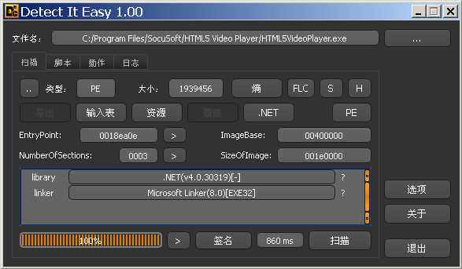

# Html Video Player 1.2.5 Stack Overflow 漏洞分析

> 第一次进行实际漏洞的分析，先从一个比较简单的栈溢出漏洞上手，顺便认识一下windows Pwn
>
> 跟着[M4x大哥的教程](http://m4x.fun/post/html5-video-player-1.2.5-local-buffer-overflow-analysis/)走一发

经过对程序的检查，程序使用.net架构，可以用dnspy进行反编译分析，能够清晰的看到内部程序逻辑。

已经判断出来，溢出发生在进行注册时的账号和密码，可以通过keyword搜索定位到程序的对应位置，对溢出情况进行分析

